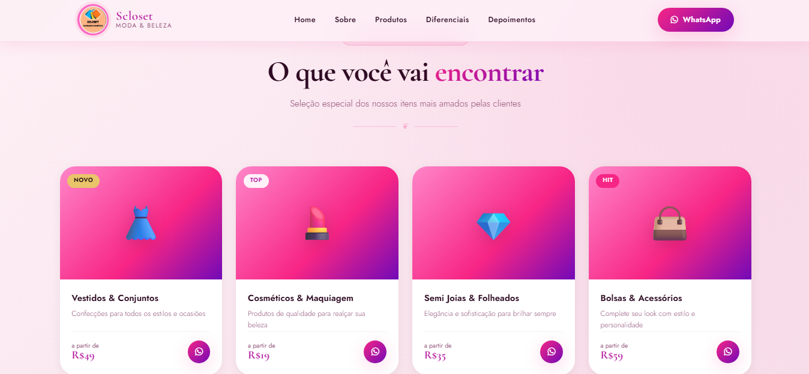
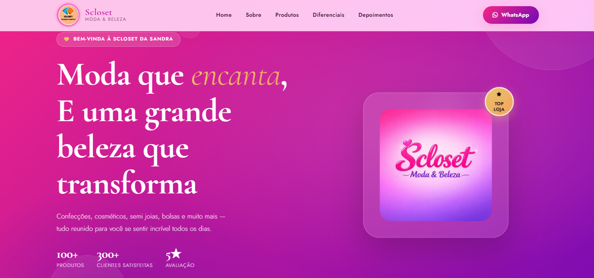

Scloset Landing Page

Esse projeto é uma aplicação web que fiz para uma landing page para a loja da minha mae, foi meu um projeto complicado de codar no css e o quarto de todos.

A ideia foi criar algo bonito, dinamico e que atraisse pela a beleza e funcionalidade.

O que dá pra fazer

Entrar em contato com instagram e whatssap
Informacoes completas
Alta beleza
✅

HTML
CSS
JavaScript (puro)

Pré-visualização

Acessar o projeto

https://bryanfellas.github.io/Scloset/

Rodar localmente

git clone  https://bryanfellas.github.io/Scloset/.git
cd landingpage
Depois é só abrir o index.html.

Fiz esse projeto pra treinar uso de APIs e CSS. 
